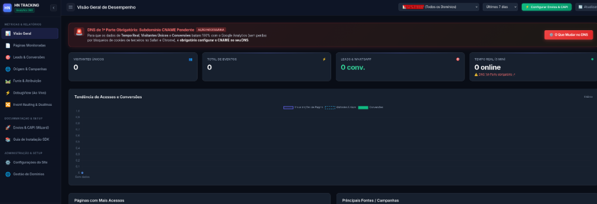
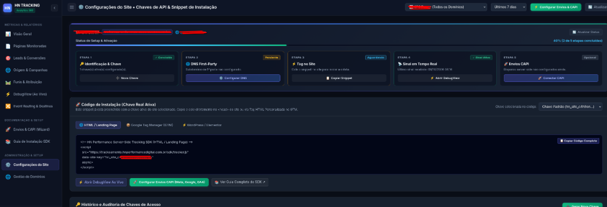
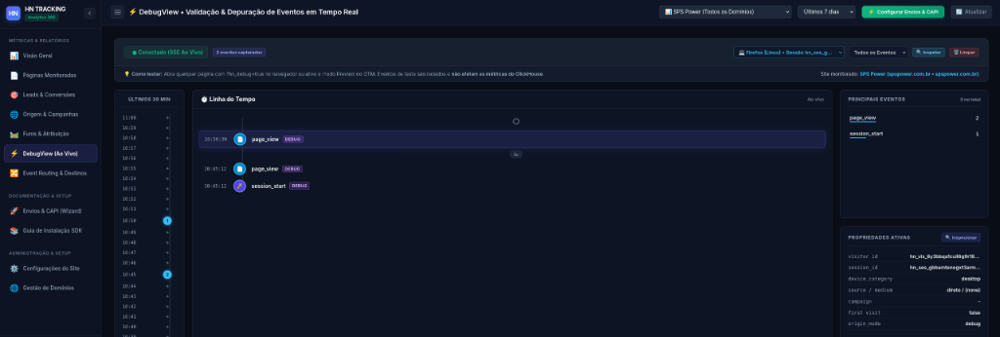
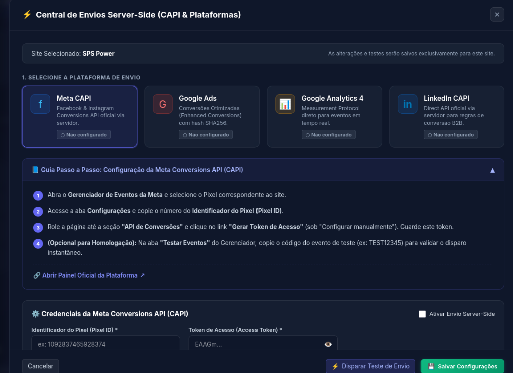
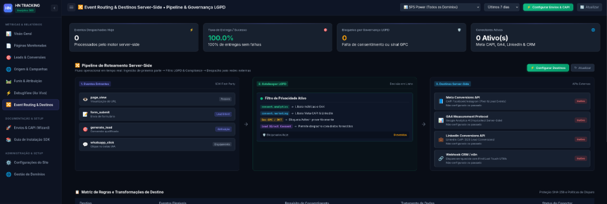

# 🚀 HN Server-Side Tracking Engine

<div align="center">


**Plataforma corporativa de rastreamento server-side de 1ª parte (*First-Party*), atribuição multitouch de conversões e despacho assíncrono para redes de anúncios com governança estrita de privacidade.**

</div>

---

## 📸 Visão Geral da Plataforma

<div align="center">
  
  <p><em>Painel Analítico Unificado: Métricas de visitantes únicos, eventos em tempo real, monitoramento de saúde do DNS First-Party e tendências de conversão.</em></p>
</div>

---

## 🎯 Por Que Esta Plataforma Existe?

O rastreamento tradicional baseado em pixels de terceiros (*3rd-party cookies*) no navegador sofreu perdas de **30% a 50% de dados** devido a:
1. **Bloqueadores de Anúncios e Extensões:** uBlock Origin, Brave Shields e AdBlockers bloqueiam domínios de terceiros conhecidos.
2. **Apple ITP e Safari (iOS 14.5+):** Descarte forçado de cookies analíticos e limitação da vida útil para 24 horas ou 7 dias.
3. **Desconexão de Atribuição:** A conversão final no WhatsApp ou CRM não conversa com o primeiro clique da campanha que gerou o lead.

O **HN Tracking Engine** neutraliza essas restrições operando como um **Túnel de 1ª Parte (First-Party Gateway)** através de subdomínios dos próprios clientes (ex: `track.spspower.com.br`), calculando a identidade do visitante deterministicamente no servidor e despachando as conversões de forma assíncrona diretamente para as APIs dos canais de mídia (Meta CAPI, Google Ads, GA4 e LinkedIn).

---

## 🏛️ Arquitetura do Sistema

```
                      INTERNET / SITES DOS CLIENTES / GTM
                                       │
                                       ▼
                       ┌───────────────────────────────┐
                       │   First-Party Ingress Gateway │ (SSL Let's Encrypt Automático)
                       │       (Subdomínio CNAME)      │ (ex: track.cliente.com.br)
                       └───────────────┬───────────────┘
                                       │
                                       ▼
                       ┌───────────────────────────────┐
                       │          Go API Coletor       │ (Latência sub-milissegundo)
                       │        (cmd/api :8080)        │ (Anti-Bot + Identidade Cookieless)
                       └───────────────┬───────────────┘
                                       │ XADD stream:events:raw
                                       ▼
                       ┌───────────────────────────────┐
                       │          Redis 7.2            │ (Buffer de Streaming Resiliente)
                       └───────────────┬───────────────┘
                                       │
                         ┌─────────────┴─────────────┐
                         ▼                           ▼
              ┌─────────────────────┐     ┌─────────────────────┐
              │  Go Batch Ingester  │     │    Go Dispatcher    │
              │  (Flush a cada 2s / │     │  (Pool Concorrente  │
              │   2.000 eventos)    │     │   com Retry & CAPI) │
              └──────────┬──────────┘     └──────────┬──────────┘
                         │                           │
                ┌────────┴────────┐        ┌─────────┼─────────┬─────────┐
                ▼                 ▼        ▼         ▼         ▼         ▼
          ┌───────────┐    ┌──────────┐  ┌────┐   ┌──────┐  ┌────────┐ ┌─────┐
          │PostgreSQL │    │ClickHouse│  │Meta│   │Google│  │LinkedIn│ │ CRM │
          │Identidade │    │ Analítico│  │CAPI│   │ Ads  │  │  CAPI  │ │ n8n │
          │& Metadados│    │  (OLAP)  │  └────┘   └──────┘  └────────┘ └─────┘
          └───────────┘    └──────────┘
```

---

## 🌟 Módulos e Interfaces da Aplicação

### 1. Onboarding Guiado & Gestão de Chaves de Acesso
Assistente interativo de 5 etapas para colocar um novo site em produção em minutos:

<div align="center">
  
</div>

- **Identificação com Prefixos Tipados:** Chaves criptografadas no formato padronizado `hn_site_...`.
- **Validador de DNS First-Party:** Instruções passo a passo de apontamento CNAME com feedback em tempo real.
- **Snippets Resilientes Multiformato:** Código pronto para HTML puro, Google Tag Manager (GTM) e WordPress/Elementor, já equipado com tratamento de erro e telemetria no console.

---

### 2. Validação & Depuração em Tempo Real (DebugView)
Transmissão contínua de eventos via **Server-Sent Events (SSE)** com isolamento total entre tráfego de depuração e métricas analíticas:

<div align="center">
  
</div>

- **Linha do Tempo Visual:** Acompanhamento instantâneo de disparos (`page_view`, `session_start`, `form_attempt`, `whatsapp_click`).
- **Inspeção Profunda de Propriedades:** Visualização do `visitor_id`, `session_id`, parâmetros de UTM, geolocalização e sinais de hardware do dispositivo.
- **Simulador de Eventos Sintéticos:** Ferramenta integrada para injetar eventos de teste e verificar integrações sem necessitar de acessos reais.

---

### 3. Central de Envios Server-Side (CAPI Wizard)
Painel unificado para conexão e homologação das APIs de conversão server-side:

<div align="center">
  
</div>

- **Meta Conversions API (CAPI):** Despacho direto de conversões com normalização e hashing SHA-256 de dados do titular (`em`, `ph`), deduplicação com Meta Pixel e código de teste de eventos.
- **Google Ads Enhanced Conversions:** Envio de dados enriquecidos com suporte a `gclid`, `gbraid` e `wbraid`.
- **Google Analytics 4 Measurement Protocol:** Suporte completo ao MP do GA4 com validação de payload em tempo real.
- **LinkedIn Conversions API (Rest.li 2.0):** Cálculo dinâmico da versão ativa da API (prevenindo quebras por depreciação) e tratamento semântico de erros B2B.

---

### 4. Pipeline de Roteamento de Eventos & Governança LGPD
Mecanismo visual de controle de tráfego, conformidade legal e roteamento seletivo de eventos:

<div align="center">
  
</div>

- **Gatekeeper LGPD em Linha:** Filtragem automatizada por categoria de consentimento (`necessary`, `analytics`, `marketing`).
- **Respeito ao Global Privacy Control (GPC):** Reconhece cabeçalhos `Sec-GPC: 1` e desativa automaticamente o despacho para terceiros caso o visitante opte pelo não rastreamento.
- **Anonimização de IP:** Truncamento automático de IPv4 (`/24`) e IPv6 (`/48`) antes da persistência no banco colunar.
- **Proteção de Campos Sensíveis:** Bloqueio no SDK de campos como senhas, cartões de crédito e tokens de segurança.

---

## 🩺 Ferramenta CLI de Diagnóstico Pré-Voo (`scripts/check_gateway.sh`)

Para garantir que o subdomínio First-Party de um novo cliente está 100% operacional antes de publicar as tags no GTM ou em produção, a aplicação inclui um utilitário CLI de verificação em 4 etapas:

```bash
./scripts/check_gateway.sh track.spspower.com.br
```

### Exemplo de Saída:
```text
======================================================================
🩺 HN GATEWAY DOCTOR: Diagnóstico Pré-Voo de First-Party Domain
======================================================================
Alvo: track.spspower.com.br

[1/4] Verificando Resolução DNS...
  ✔ CNAME detectado: trackeamento.hnperformancedigital.com.br.
  ✔ Resolução de IP OK: 178.253.250.73

[2/4] Verificando Handshake TLS & Certificado SSL...
  Subject: subject=CN=trackeamento.hnperformancedigital.com.br
  Issuer : issuer=C=US, O=Let's Encrypt, CN=YR2
  ✔ Certificado SSL emitido por Autoridade Certificadora válida!
  Validade até: Jan 7 17:06:49 2027 GMT

[3/4] Testando Acesso ao SDK Tracker via HTTPS...
  ✔ Status HTTP 200 OK: O script /sdk/tracker.js foi entregue com sucesso!

======================================================================
🎉 SUCESSO: O domínio track.spspower.com.br está 100% OPERACIONAL e seguro!
Pode ser utilizado no Google Tag Manager sem risco de bloqueio TLS.
```

---

## 💻 Instalação da Tag no Site do Cliente

### Snippet Padrão Recomendado (HTML / GTM)
Insira a tag no `<head>` ou utilize uma Tag HTML Personalizada no Google Tag Manager:

```html
<!-- HN Performance First-Party Ingress Snippet (Cookieless & Resiliente) -->
<script
  src="https://track.seudominio.com.br/sdk/tracker.js"
  data-site-key="hn_site_seu_token_ativo_aqui"
  onerror="console.error('[HN Tracking] Erro ao carregar tracker.js. Verifique DNS e certificado SSL.');"
  async>
</script>
```

### Disparo Manual de Conversões Qualificadas (JavaScript):
```javascript
window.hnTrack('purchase', {
  user_data: {
    email: 'cliente@exemplo.com.br',
    phone: '21999998888',
    name: 'Nome do Cliente'
  },
  custom_data: {
    value: 197.00,
    currency: 'BRL',
    order_id: 'PED-12345'
  }
});
```

### Gestão de Consentimento LGPD (Integração com Banners de Cookies):
```javascript
window.hnTrack('consent', {
  necessary: true,
  analytics: true,
  marketing: false // Desativa persistência de UTMs e despacho para Meta/Google
});
```

---

## 🛠️ Stack Tecnológica

| Componente | Tecnologia | Versão | Função Principal |
| :--- | :--- | :--- | :--- |
| **Linguagem Backend** | Go (Golang) | 1.24+ | Microsserviços compilados de concorrência massiva e latência sub-milissegundo. |
| **Framework HTTP** | Fiber v2 / fasthttp | v2.52 | Roteamento HTTP de ultra-alta performance com suporte a keep-alive e proxies. |
| **Banco Analítico** | ClickHouse Server | 24+ | Armazenamento colunar OLAP para agregação de milhões de eventos por segundo. |
| **Banco Transacional** | PostgreSQL | 16+ | Grafo de identidade de visitantes, metadados de sites, chaves de API e tenants. |
| **Streaming & Buffer** | Redis | 7.2 | Buffer de ingestão de eventos via Redis Streams (`stream:events:raw`). |
| **Ingress & Proxy** | Traefik v3 / Caddy v2 | v2/v3 | Terminação TLS sob demanda com Let's Encrypt para N subdomínios de clientes. |
| **SDK Frontend** | Vanilla JavaScript | ES5/ES6 | Script ultraleve (< 4 KB), sem dependências externas, compatível com GTM. |
| **Orquestração** | Docker & Compose | 2+ | Empacotamento unificado de containers e gerenciamento via Portainer. |

---

## 🚀 Inicialização Rápida em Desenvolvimento

1. **Clone o repositório e configure as variáveis de ambiente:**
   ```bash
   cp .env.example .env
   ```

2. **Inicie os serviços via Docker Compose:**
   ```bash
   docker compose up -d --build
   ```

3. **Acesse as interfaces da aplicação:**
   - **Status da API:** [http://localhost:8080/health](http://localhost:8080/health)
   - **Dashboard Administrativo:** [http://localhost:8080/dashboard](http://localhost:8080/dashboard) (Credenciais no `.env`)
   - **Guia do SDK:** [http://localhost:8080/docs](http://localhost:8080/docs)
   - **Script do SDK:** [http://localhost:8080/sdk/tracker.js](http://localhost:8080/sdk/tracker.js)

4. **Executar a suíte completa de testes:**
   ```bash
   go test -v -race ./...
   ```

---

## 📖 Documentação Complementar

- [Manual Técnico e Guia de Verificação Interna (Auditoria e Telas)](docs/MANUAL_DE_VERIFICACAO_INTERNA.md)
- [Especificação de Governança de Dados e Privacidade LGPD / ANPD](docs/PRIVACY_AND_DATA_GOVERNANCE.md)
- [Manual de Deploy de Novos Clientes via Imagem Docker Hub](docs/DEPLOY_NOVO_CLIENTE_DOCKERHUB.md)
- [Contexto de Arquitetura e Diretrizes para Agentes de IA](docs/CONTEXTO_AGENTES.md)
- [Procedimentos e Guia de Deploy em Produção](DEPLOY.md)

---

## 📄 Licença

Distribuído sob a licença **MIT**. Consulte `LICENSE` para mais detalhes.
